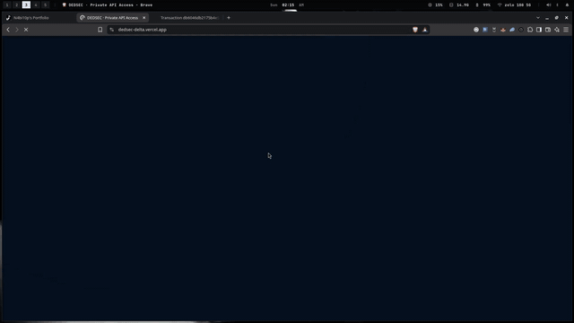

# dedsec

[](https://github.com/n4bi10p/dedsec/actions/workflows/ci.yml)

A privacy-preserving paid-access gateway on the Midnight Network. The contract
in this repository is a counter with a private witness: the ledger learns the
increment, and the caller's budget stays off-chain.

## Live Demo

https://dedsec-delta.vercel.app

The production bundle reads `frontend/.env.production`, which targets Midnight
**Preprod**. Vite inlines those values at build time, so a Vercel env change
does nothing until the project is redeployed. Connect 1AM on Preprod before
calling the circuit. After a successful increment the UI shows an
indexer-confirmed transaction hash linked to `https://explorer.1am.xyz/tx/<hash>`.

```bash
npm run frontend:build
```

## Contract Address

Mandatory Preprod counter:

```text
77641b3184ca1a5f0f84c36802953f3a52830c288fe302b6766b0a7d46e50b07
```

| Contract | Network | Address | Used by |
| --- | --- | --- | --- |
| `counter` | Preprod | `77641b3184ca1a5f0f84c36802953f3a52830c288fe302b6766b0a7d46e50b07` | Frontend (`VITE_COUNTER_ADDRESS`) |
| `counter` | Preview | `103ef1adb05ba6ce1391ab40d61e7e756245f4322c300abfa582b4ba5e4467bb` | Earlier Preview deployment |
| `hello-world` | Preprod | `1e7ea53d7b0751f3574135605c11b432b003f0b6d846827381365c4caafefa9a` | Scaffold reference |
| `hello-world` | Preview | `ceb74c06aaead115b2176986a03a5ae02dc5e78b7f3f9fdf5fda755d95786264` | Scaffold reference |
| `hello-world` | Undeployed | `f180b4742bef75fdcd38426b635251469b19b03a4436cc9a33d5d400a7859e9e` | Local devnet |

`npm run setup` deploys `hello-world` by default. Deploy the counter with
`CONTRACT_NAME=counter`.

## What This Does

`contracts/counter.compact` is a small on-chain counter with a privacy twist:

- The **counter value** and the **last delta** live in public ledger cells.
- Every increment is a circuit with two inputs:
  - `publicDelta` — disclosed, written to the ledger;
  - `secretCap` — a private witness known only to the caller.
- The circuit proves `publicDelta <= secretCap` without revealing the cap.

That is the shape of the paid-access gateway: a caller proves a request fits a
private budget, and the ledger records only the fact that was deliberately
disclosed. The browser client lives in [`frontend/`](frontend/). It connects
to 1AM, generates the proof locally, and never renders the witness.

## Privacy Model

| Data | Visibility | Notes |
| --- | --- | --- |
| `counter` | **Public** | On-chain ledger cell. Anyone can read it through the indexer. |
| `lastDelta` | **Public** | On-chain ledger cell. The disclosed size of the latest call. |
| `publicDelta` | **Proved**, then **Public** | Passed through `disclose()` so the ledger grows by an exact amount. |
| `secretCap` | **Private** | Circuit witness. Proven, never written on-chain, never shown in the UI. |

`disclose()` is the only channel from an input to the ledger. Tests assert
that the ledger contains `counter` and `lastDelta` and nothing else.

## Privacy Claim

The frontend generates `secretCap` locally and never renders, logs, or sends
it to the application UI. The counter circuit proves `publicDelta <= secretCap`.
Only the deliberately disclosed delta and the public ledger state are
submitted. The wallet connector checks the network from `getConfiguration()`
and refuses the circuit call when 1AM is on a different network than
`VITE_NETWORK`. The screen label is: Proved without revealing your input.

## Tech Stack

| Layer | Technology |
| --- | --- |
| Language | Compact |
| Compiler | `compact 0.5.1` |
| SDK | `@midnight-ntwrk/*` `4.1.1` (`midnight-js-contracts`, `wallet-sdk 1.2.0`, `compact-runtime 0.16.0`) |
| Frontend | React 19 + Vite, in `frontend/` |
| Wallet | 1AM through the Midnight DApp Connector API |
| Testing | Vitest 4 + local devnet (node, indexer, proof server) |
| Devnet | Docker Compose (`midnightntwrk/midnight-node:1.0.0`, `indexer-standalone:4.3.3`, `proof-server:8.1.0`) |
| Runtime | Node.js 22 |

This repository is a monorepo. Contract tooling is at the root. The browser
app is in `frontend/` because it has its own `package.json`. CI installs and
builds that directory explicitly. See [Project structure](#project-structure).

## Prerequisites

- Node.js 22 or newer
- Docker with Docker Compose v2, for the local devnet and the test suite
- The Compact compiler pinned to `0.5.1`
- 1AM, for the browser flow

```bash
npm install
npm install --prefix frontend
```

## Setup & Run Locally

Start the local devnet, compile, and deploy:

```bash
npm run compile
docker compose up -d --wait
npm run deploy
CONTRACT_NAME=counter npm run deploy
```

Run the browser app from the repository root:

```bash
npm run frontend:dev
npm run frontend:build
```

`frontend/.env.development` points the dev server at the Preprod counter.
Switch 1AM to Preprod before connecting. To deploy the counter again on
Preprod, with a funded wallet:

```bash
npm run network preprod
CONTRACT_NAME=counter npm run deploy -- --network preprod
```

For hosting, set the project root to `frontend/`. The root `vercel.json`
builds that directory. `frontend/public/_redirects` is the Netlify SPA
fallback.

## Run Tests

`npm test` compiles the contracts, starts the devnet if needed, and runs the
counter suite against the local devnet:

```bash
npm test
```

To run only the counter tests against an already-running devnet:

```bash
npx vitest run tests/counter.test.ts
```

The suite covers the three required areas:

1. **Circuit logic** — an increment within the secret cap succeeds; an increment past the cap is rejected and leaves state untouched.
2. **State transitions** — `counter` and `lastDelta` update across sequential increments, including the boundary where the delta equals the cap.
3. **Privacy** — the ledger exposes exactly `counter` and `lastDelta`. `secretCap` never appears on-chain.

## CI/CD

[`.github/workflows/ci.yml`](.github/workflows/ci.yml) runs on every push to
`main` and on pull requests.

The contract job:

1. checks out the repository
2. installs Node.js 22
3. installs Compact `0.5.1`
4. runs `npm ci`
5. compiles the Compact contracts
6. runs `npm test`

The frontend job installs `frontend/` and runs `npm run frontend:build`.
Either job failing fails the workflow.

The badge at the top of this file tracks that workflow.

## Product Proposal

The product write-up is [PROPOSAL.md](PROPOSAL.md): who DEDSEC is for, why the
proof belongs on Midnight, the public and private data model, and what has to
be true before mainnet.

## Screenshots

- Compile, with the `increment` circuit listed


- Deploy, with the contract address shown


## Demo Video

<a href="dedsec-intro.mp4">
  
</a>

[Open or download the MP4 demo](dedsec-intro.mp4).

The recording connects 1AM, calls the increment circuit, waits for the local
proof, and shows the on-chain result. `secretCap` is never on screen. A
one-minute Level 3 recording that also shows the test output and the green CI
badge is still to be captured after this workflow has run.

## Local devnet

| Service | Port | Purpose |
| --- | --- | --- |
| `node` | 9944 | Midnight node, `dev` chain preset |
| `indexer` | 8088 | GraphQL indexer for chain state |
| `proof-server` | 6300 | ZK proofs for contract transactions |

```bash
docker compose down -v
```

The deploy script uses a well-known genesis seed (`0000…0001`) so the
pre-minted NIGHT in the `dev` chain preset is available immediately. Do not
use this seed against Preprod, mainnet, or any environment that handles real
value.

## Networks

| Network | When to use | Default for local scripts? |
| --- | --- | --- |
| `undeployed` | Local devnet in `docker-compose.yml`. Genesis seed is hardcoded. | yes |
| `preview` | Public preview testnet. Faucet: `https://midnight-tmnight-preview.nethermind.dev` | |
| `preprod` | Challenge network for the frontend and for user testing. Faucet: `https://midnight-tmnight-preprod.nethermind.dev` | frontend |

The script network is sticky. Switch with `npm run network <name>` or
`--network <name>`. Return to the local devnet with
`npm run network undeployed`.

| Variable | Effect |
| --- | --- |
| `MIDNIGHT_WALLET_SEED` | Use this seed instead of generating one. |
| `MIDNIGHT_INDEXER_URL` | Override the indexer GraphQL URL. |
| `MIDNIGHT_INDEXER_WS_URL` | Override the indexer WebSocket URL. |
| `MIDNIGHT_NODE_URL` | Override the node RPC URL. |
| `MIDNIGHT_FAUCET_URL` | Override the faucet URL printed during setup. |
| `MIDNIGHT_PROOF_SERVER_URL` | Override the proof server URL. |
| `MIDNIGHT_FAUCET_TIMEOUT_MS` | Faucet poll budget in milliseconds (default 600000). |

After `deploy`, `cli`, or `check-balance`, the scripts store the wallet's
synced state in `.midnight-wallet-state/<network>/` (gitignored). The next run
on that network restores the snapshot.

## Available scripts

| Script | Description |
| --- | --- |
| `npm run setup` | Start the devnet, compile, and deploy. |
| `npm run compile` | Compile `hello-world` and `counter`. |
| `npm run deploy` | Deploy the selected contract. |
| `npm run deploy:counter` | Deploy the `counter` contract. |
| `npm run cli` | Call circuits on the deployed contract. |
| `npm run check-balance` | Print NIGHT and DUST balances. |
| `npm test` | Compile, start the devnet, and run Vitest. |
| `npm run test:e2e` | Smoke and read-back check. |
| `npm run frontend:dev` | Start the Vite app. |
| `npm run frontend:build` | Typecheck and build the Vite app. |
| `npm run clean` | Remove compiled artifacts and local wallet state. |

## Project structure

```text
dedsec/
├── contracts/
│   ├── counter.compact
│   └── hello-world.compact
├── contracts/managed/          # compiler output, gitignored
├── frontend/                   # React + Vite client
├── tests/
│   ├── counter.test.ts
│   └── helpers/contract-deploy.ts
├── src/                        # Node deploy, CLI, and wallet scripts
├── .github/workflows/ci.yml
├── PROPOSAL.md
├── docker-compose.yml
└── package.json
```

## Compact compiler version

The compiler is pinned to `0.5.1`.

```bash
compact update 0.5.1
compact use 0.5.1
```
